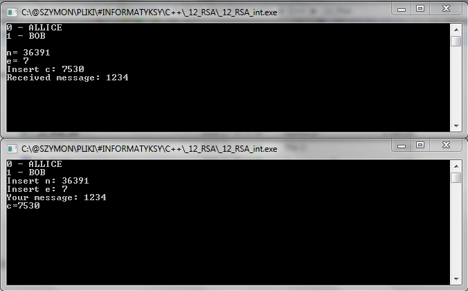

# RSA
Small scale RSA encryption. (PL)

Protokół RSA to nowoczesny sposób przekazywania informacji z jawnym kluczem.  
W moim programie komunikacja zachodzi między ALICE która ustal klucz i jest odbiorcą wiadomości, a BOBem, który wysyła wiadomość.

Ideą działania RSA jest to, że Alice wysyła "w świat" swoje klucze,  
za pomocą których teoretycznie każdy może zakodować wiadomość,  
oraz wysłać jej tak, że tylko ona będzie mogła ją odkodować.  
Jest to możliwe dzięki paru matamatycznym sztuczkom, skupionym wokół  
funkaji Eulera, jej właściwości, arytmetyki modularnej i liczb pierwszych.  
  
Wikipedia dla zainteresowanych:  
https://pl.wikipedia.org/wiki/RSA_(kryptografia)  
  
Profesjonalne szyfrowanie RSA wykorzystuje klucze długości setek bitów,  
mi nie udało się tymczasowo tego osiągnąć, chociaż myślę że jestem blisko,  
obecna wersja jest czysto symboliczna (złamanie jej nie zajęło by sekundy),  
ale myślę że w pełni pokazuje działanie RSA, różni się tylko typami danych.  
Niestety prawdopodobnie nie udało mi się nawet w 100% wykożystać typu long long,  
ponieważ gdzieś w kodzie następuje overflow przy większych liczbach - początkowe  
klucze p generuję do 999, chociaż według moich obliczeń po optymalizacji powinno dać się  
nawet do 10^10.  
  
Przykładowy interface:  
  
  
Kod jast dosyć ładnie skomentowany po angielsku,  
może to też kiedyś przetłumaczę żeby było porządnie.  
  
Proszę rapartować błędy.
